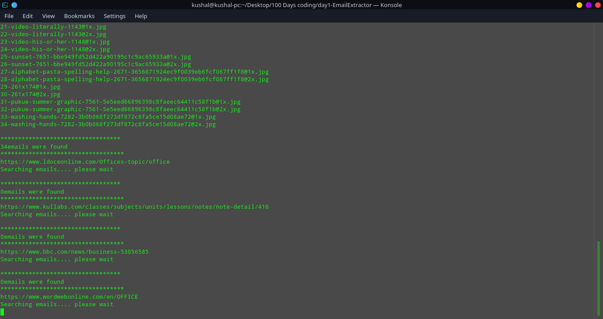
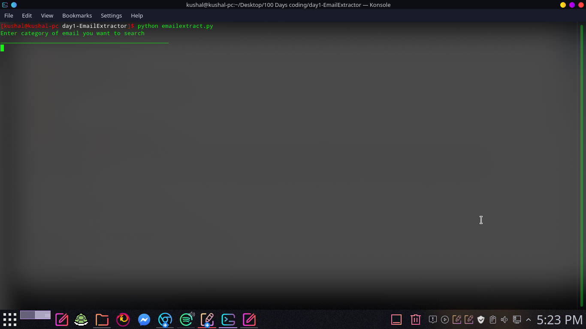
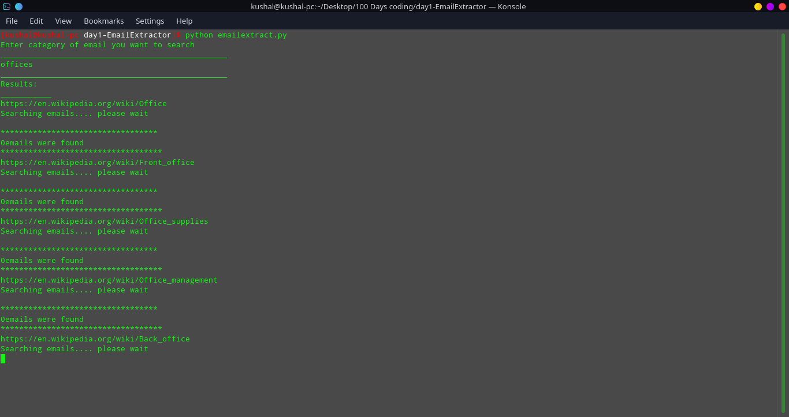

# EMAIL EXTRACTOR
> This is a email extractor program that uses google to search email address


This Program searches for a categories of email address  your are searching for using web scraping and file to save the emails. I made this program for a email marketing in a company. It easily searches for a email address in a google and make a list of it and saves in a file.
example: you can search a categories like 
schools 
and it will search for list of schools near you and saves in a file



## Installation

OS X & Linux:

```sh
pacman -S python-beautifulsoup4
pacman -S python-google
```


## Usage example

To run this program you just have to open terminal and type 
```sh
python emailextract.py
```
after you type the command it terminal this will show up

after this search for whatever you want



## Release History

* 0.2.0
    * CHANGE: Update docs (module code remains unchanged)
* 0.2.1
    * CHANGE: fixed error at terminal
    * ADD: Add README.md file`
* 0.2.2
    * Work in progress

## Known Bugs

 1. some other text also get's saved as email 

## Meta

Kushal Luitel – [@Kushalluitel1](https://twitter.com/Kushalluitel1) – kushalluitel3502@Gmail.com

Distributed under the MIT license. See ``LICENSE`` for more information.

[https://github.com/kushal12345/Email-extractor](https://github.com/kushal12345/)

## Contributing

1. Fork it (<https://github.com/kushal12345/Email-extractor/fork>)
2. Create your feature branch (`git checkout -b feature/Email-extractor`)
3. Commit your changes (`git commit -am 'Add some Email-extractor'`)
4. Push to the branch (`git push origin feature/Email-extractor`)
5. Create a new Pull Request

<!-- Markdown link & img dfn's -->

[wiki]: https://github.com/kushal12345/Email-extractor/wiki
